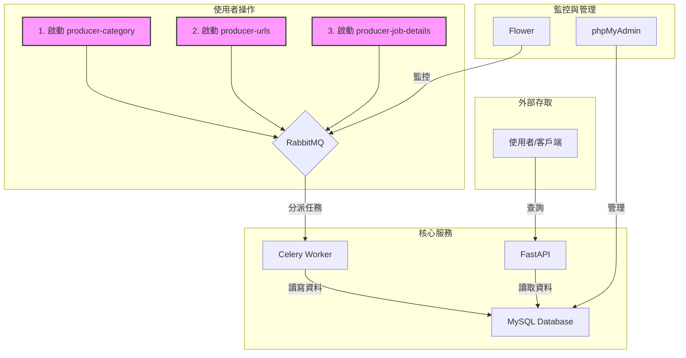

# 104 Job Crawler & Data API


這是一個高效、可擴展的分散式爬蟲系統，專為抓取 **104 人力銀行** 的職缺資料而設計。本系統採用現代化的技術棧，將原始資料轉化為結構化的資訊，並透過 API 提供服務。

## ✨ 核心功能

-   **📈 可擴展架構**: 使用 Celery 作為任務佇列，可以輕鬆地橫向擴展 Worker 數量以應對大規模抓取需求。
-   **📦 容器化部署**: 所有服務皆透過 Docker 容器化，使用 Docker Compose 進行一鍵部署，確保環境一致性。
-   **💪 健壯的任務流程**: 任務流程切分為三個獨立階段（類別、URL、詳細資料），並具備重試與錯誤處理機制。
-   **💾 持久化儲存**: 抓取到的資料儲存於 MySQL 資料庫，確保資料的持久性與可查詢性。
-   **🚀 高效能 API**: 基於 FastAPI 提供非同步 API，可快速查詢已處理的職缺資料。
-   **👀 即時監控**: 整合 Flower 與 RabbitMQ Management UI，提供視覺化的任務與佇列監控儀表板。

## 🏛️ 系統架構

本系統採用基於訊息佇列的生產者-消費者模式。`Producers` 負責建立任務並發送到 `RabbitMQ`，而 `Celery Workers` 則從佇列中獲取任務並執行實際的爬取工作。所有資料最終都儲存在 `MySQL` 中，並由 `FastAPI` 提供查詢接口。



## 🌊 資料處理流程

資料的抓取與處理遵循一個清晰的三階段流程，確保資料的完整性與一致性。

1.  **階段一：抓取職缺類別 (Category)**
    -   **觸發器**: `producer-category`
    -   **任務**: `process_category_data`
    -   **說明**: 從 104 的靜態 JSON 檔案獲取所有職缺的分類代碼與名稱。此資料會被快取以避免重複請求，並儲存至 `tb_category` 表格。

2.  **階段二：抓取職缺 URL 列表 (URL List)**
    -   **觸發器**: `producer-urls`
    -   **任務**: `fetch_and_save_all_urls`
    -   **說明**: 根據 `.env` 中設定的職缺類別 (`JOBCAT_CODE`) 和關鍵字 (`KEYWORDS`)，併發地爬取 104 的搜尋結果頁面，收集所有符合條件的職缺 URL，並將它們存入 `tb_urls` 表格。

3.  **階段三：抓取職缺詳細內容 (Job Details)**
    -   **觸發器**: `producer-job-details`
    -   **任務**: `fetch_and_save_all_job_details`
    -   **說明**: 從 `tb_urls` 表格讀取所有待處理的 URL，併發地請求每個職缺的 AJAX API 以獲取詳細的 JSON 資料。資料經過解析、清理與驗證後，最終儲存至 `tb_jobs` 表格。

## 🚀 開始使用

### 1. 環境準備

請確保您的系統已安裝以下軟體：
-   [Docker](https://docs.docker.com/get-docker/)
-   [Docker Compose](https://docs.docker.com/compose/install/)

### 2. 設定

首先，複製專案儲存庫：
```bash
git clone https://github.com/soldierHuang/crawler_104_docker.git
cd crawler_104_docker
```

接著，在專案根目錄下建立一個 `.env` 檔案。此檔案用於存放所有服務的環境變數。

**`.env` 檔案範本:**
```env
# .env

# ==================================
# ====== 資料庫設定 (MySQL) ======
# ==================================
MYSQL_ROOT_PASSWORD=your_strong_root_password
MYSQL_DATABASE=job_data
MYSQL_USER=user
MYSQL_PASSWORD=password
MYSQL_HOST=mysql
MYSQL_PORT=3306

# ==================================
# ====== 訊息佇列設定 (RabbitMQ) ======
# ==================================
RABBITMQ_DEFAULT_USER=guest
RABBITMQ_DEFAULT_PASS=guest
RABBITMQ_HOST=rabbitmq
RABBITMQ_PORT=5672

# ==================================
# ====== 104 爬蟲參數設定 ======
# ==================================
# 職缺類別代碼 (例如: 2007000000 代表軟體及工程相關類)
# 您可以在 104 網站的 URL 中找到，或參考 `crawler/project_data/104_人力銀行_jobcat_json.txt`
JOBCAT_CODE=2007000000

# 搜尋關鍵字 (用逗號分隔，無空格)
KEYWORDS=Python,Golang,Java,Backend,DevOps

# 每個關鍵字要爬取的最大頁數
MAX_PAGES=100

# 排序方式 (15: 符合度, 16: 最近更新)
ORDER_SETTING=15
```

### 3. 啟動系統

在專案根目錄下，執行以下指令來建置映像檔並在背景啟動所有服務：

```bash
docker compose up --build -d
```

## 🛠️ 操作指南

服務啟動後，您可以依照資料流程，依序執行以下指令來觸發各階段的爬蟲任務。

**1. 抓取職缺類別 (建議初次執行時運行)**
```bash
docker compose run --rm producer-category
```

**2. 抓取職缺 URL 列表**
```bash
docker compose run --rm producer-urls
```

**3. 抓取職缺詳細內容**
```bash
docker compose run --rm producer-job-details
```

## 📊 存取服務與資料

系統啟動後，您可以透過以下端點存取各個服務：

| 服務 | URL | 憑證 |
| :--- | :--- | :--- |
| **Job Data API (Swagger)** | [http://localhost:8000/docs](http://localhost:8000/docs) | - |
| **Flower (Celery Monitor)** | [http://localhost:5555](http://localhost:5555) | - |
| **RabbitMQ Management** | [http://localhost:15672](http://localhost:15672) | `guest` / `guest` |
| **phpMyAdmin** | [http://localhost:8080](http://localhost:8080) | Server: `mysql`, User/Pass from `.env` |

### API 查詢範例

您可以使用 `curl` 或任何 HTTP 客戶端來查詢 API。建議搭配 `jq` 來格式化 JSON 輸出。

**查詢職稱包含 "Python" 的前 5 筆職缺：**
```bash
curl -s "http://localhost:8000/jobs/?title=Python&limit=5" | jq
```

**查詢公司名稱包含 "新加坡商" 的職缺：**
```bash
curl -s "http://localhost:8000/jobs/?company_name=新加坡商" | jq
```

## 📁 專案結構

```
.
├── crawler/                # 爬蟲核心程式碼
│   ├── api/                # FastAPI 相關模組
│   ├── app.py              # Celery App 實例
│   ├── config.py           # 全域設定
│   ├── database/           # 資料庫連線、Schema、Repository
│   ├── project_104/        # 104 專案的 Producers 和 Tasks
│   ├── utilis/             # 通用工具函數
│   └── worker.py           # Celery Worker 進入點
├── .env                    # 環境變數 (需手動建立)
├── .gitignore              # Git 忽略檔案列表
├── docker-compose.yml      # 主要服務定義
├── docker-compose.producer.yml # Producer 服務的獨立定義 (可選)
├── Dockerfile              # 應用程式的 Docker 映像檔定義
└── README.md               # 本文件
```

## 🛑 停止服務

-   **停止所有服務**:
    ```bash
    docker compose down
    ```

-   **停止並刪除所有資料磁碟區** (此操作會清除資料庫資料):
    ```bash
    docker compose down -v
    ```